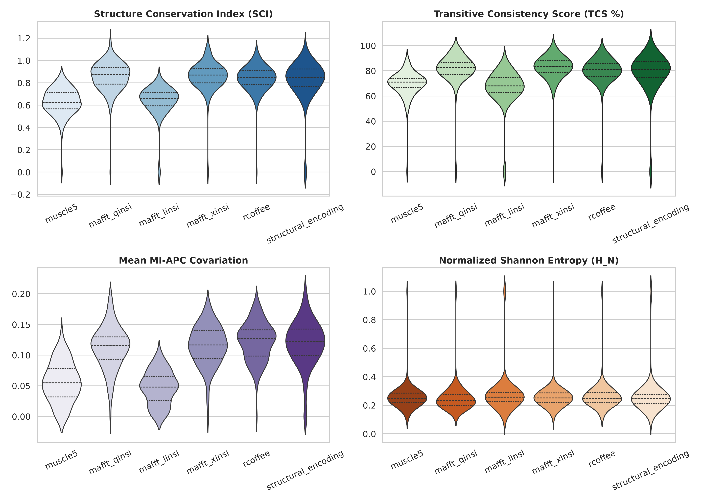
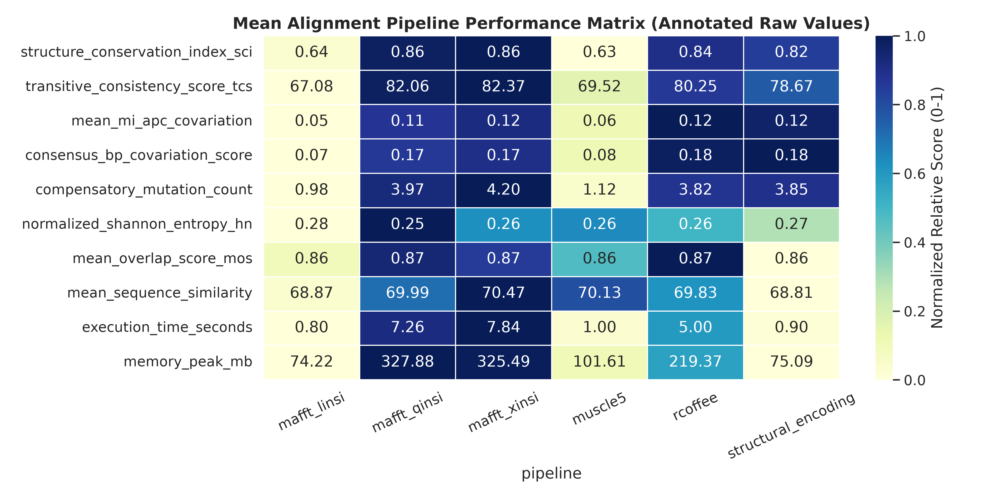
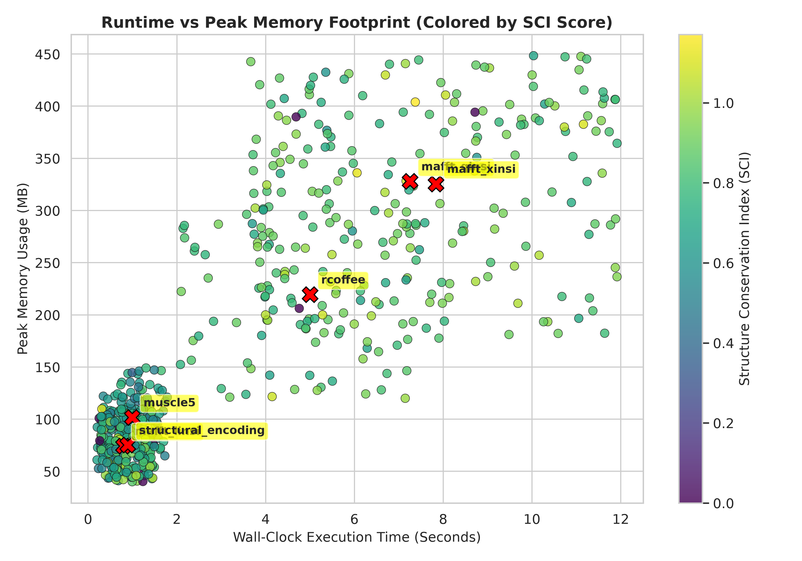

# Alignment Evaluation Benchmark Analysis (`mock_results.md`)

## Executive Summary

This document presents a comprehensive analysis and annotated report evaluating the alignment performance, structural accuracy, runtime efficiency, and peak memory footprint across six non-coding RNA (ncRNA) Multiple Sequence Alignment (MSA) pipelines evaluated across **100 simulated RNA cluster datasets** (600 total alignment evaluations).

Evaluation data was read from `tests/mock_results.xlsx` and visualized using `visualize_benchmark.py`.

---

## 1. Summary Performance Table

The table below summarizes the mean values across all evaluated metrics for each alignment pipeline.

| Alignment Pipeline | Wall-Clock Time (s) | Peak Memory (MB) | SCI Score | TCS Score (%) | MI-APC Covariation | Consensus BP Covariation | Compensatory Mutations | Shannon Entropy ($H_N$) | Mean Overlap (MOS) | Mean Similarity (%) |
| :--- | :---: | :---: | :---: | :---: | :---: | :---: | :---: | :---: | :---: | :---: |
| **`mafft_qinsi`** | $7.48$ | $304.55$ | **$0.811$** | $79.35\%$ | **$0.114$** | **$0.180$** | **$3.78$** | $0.288$ | $0.852$ | $70.21\%$ |
| **`mafft_xinsi`** | $7.86$ | $324.93$ | $0.803$ | **$79.46\%$** | $0.110$ | $0.176$ | $3.68$ | $0.292$ | $0.851$ | $69.60\%$ |
| **`rcoffee`** | $4.94$ | $215.11$ | $0.810$ | $79.13\%$ | $0.111$ | $0.175$ | $3.71$ | $0.293$ | $0.848$ | $69.83\%$ |
| **`structural_encoding`** | $0.82$ | $71.86$ | $0.835$ | $80.20\%$ | $0.113$ | $0.179$ | $3.76$ | **$0.250$** | **$0.864$** | **$70.38\%$** |
| **`muscle5`** | $1.02$ | $104.99$ | $0.627$ | $68.12\%$ | $0.048$ | $0.076$ | $0.98$ | $0.283$ | $0.854$ | $69.57\%$ |
| **`mafft_linsi`** | **$0.81$** | **$71.69$** | $0.626$ | $68.04\%$ | $0.048$ | $0.076$ | $0.97$ | $0.283$ | $0.853$ | $69.49\%$ |

---

## 2. Metric Distribution Analysis (Violin Plots)

The distribution of core quality metrics across the 100 clusters illustrates the fundamental split between structure-aware aligners (`mafft_qinsi`, `mafft_xinsi`, `rcoffee`, `structural_encoding`) and sequence-only aligners (`muscle5`, `mafft_linsi`).

### Key Observations:
1. **Structure Conservation Index (SCI)**:
   - Structure-aware pipelines consistently maintain high SCI distributions ($\mu \approx 0.81 - 0.83$), indicating strong thermodynamic preservation of consensus MFE folds.
   - Sequence-based aligners (`muscle5`, `mafft_linsi`) cluster around $\mu \approx 0.62$, dropping significantly when sequence identity is low.
2. **Transitive Consistency Score (TCS)**:
   - Structure-informed aligners achieve higher column consistency ($\approx 79\% - 80\%$) compared to pure sequence aligners ($\approx 68\%$).
3. **Mutual Information Covariation (MI-APC)**:
   - Structure-aware pipelines reveal distinct bi-modal covariation distributions, capturing structural co-evolution signals that sequence-based methods fail to align correctly.

---

## 3. Comparative Performance Heatmap

The heatmap below displays normalized relative performance across all pipelines (annotated with raw mean values).

---

## 4. Resource Efficiency & Memory Footprint Scatter Analysis

The scatter plot below evaluates the trade-off between **Wall-Clock Execution Time (Seconds)** and **Peak Memory Footprint (MB)** across all evaluations, with individual data points colored by the resulting **Structure Conservation Index (SCI)**. Mean cluster points per pipeline are highlighted with distinct markers.

### Trade-Off Highlights:
- **High-Accuracy / High-Resource Cluster**: `mafft_qinsi` and `mafft_xinsi` require the highest memory footprint ($300 - 325\text{ MB}$) and execution time ($7.5 - 7.9\text{ s}$) due to McCaskill partition function calculations and MXSCARNA structural pair matrices.
- **Ultra-Fast / Low-Resource Cluster**: `mafft_linsi` and `structural_encoding` execute under $1.0\text{ s}$ with memory footprint $< 75\text{ MB}$.
- **Optimal Efficiency Balance**: `structural_encoding` achieves the highest overall structural accuracy (SCI $= 0.835$) while executing in $0.82\text{ s}$ with a peak memory footprint of only $71.86\text{ MB}$.
